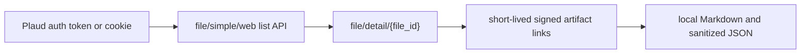

```
                                
     _           _    _     _   
 ___| |___ _ _ _| |  | |___| |_ 
| . | | .'| | | . |  | | .'| . |
|  _|_|__,|___|___|  |_|__,|___|
|_|                             
```

# Plaud Lab

[](https://skills.sh/davidvictor/plaud-lab)

> A public Codex skill and stdlib-only exporter for backing up Plaud transcripts, summaries, outlines, and generated notes through Plaud Web's internal API.

## The Problem

Plaud Web can show transcripts and summaries, but the useful data lives behind a set of internal API calls and short-lived signed artifact links. Copying text from the UI is brittle, loses metadata, and turns every backup into a manual session.

This repo turns the discovered flow into a repeatable, inspectable skill: enumerate files through the internal list API, fetch per-file detail records, immediately download the generated artifacts, and save everything locally in Markdown plus sanitized JSON.

## Why I Built This

The interesting constraint is that the stable surface is not the DOM. The page is mostly a client over structured API responses, and the detail response already tells you which artifacts exist. The exporter follows that shape directly and keeps auth local, rather than baking in account-specific browser state or scraping rendered text.

Built from a real export session, then cleaned up for public use so others can adapt the same pattern without inheriting private transcripts or machine-specific setup.

## What It Does

- Lists Plaud files with pagination parameters.
- Fetches `file/detail/{file_id}` for each recording.
- Downloads completed transcript, summary, polished transcript, outline, and note artifacts.
- Converts transcript JSON into readable Markdown with timestamps and speakers.
- Writes combined per-file Markdown plus transcript-only and summary-only folders.
- Saves sanitized raw metadata without signed S3 query strings or auth values.
- Provides a Codex skill at `skills/plaud-transcript-export`.

## How It Works



## Quick Start

```bash
git clone https://github.com/davidvictor/plaud-lab.git
cd plaud-lab

python3 skills/plaud-transcript-export/scripts/export_plaud.py --help
```

Export with a Plaud workspace token:

```bash
read -rsp "Plaud workspace token: " PLAUD_TOKEN
echo
export PLAUD_AUTH_TOKEN="Bearer $PLAUD_TOKEN"
python3 skills/plaud-transcript-export/scripts/export_plaud.py --output ./plaud-export
```

Or use a cookie from your own authenticated Plaud Web session:

```bash
read -rsp "Plaud Cookie header: " PLAUD_COOKIE
echo
export PLAUD_COOKIE
python3 skills/plaud-transcript-export/scripts/export_plaud.py --output ./plaud-export
```

## Usage

Export all files, including trash records returned by Plaud's all-files view:

```bash
python3 skills/plaud-transcript-export/scripts/export_plaud.py \
  --include-trash all \
  --output ./plaud-export
```

Export only metadata without downloading signed artifacts:

```bash
python3 skills/plaud-transcript-export/scripts/export_plaud.py \
  --metadata-only \
  --output ./plaud-metadata
```

Expected output layout:

```text
plaud-export/
  index.json
  index.csv
  files/
  transcripts/
  summaries/
  polished-transcripts/
  outlines/
  raw/<file_id>/
```

## Configuration

| Variable | Required | Default | Description |
|----------|----------|---------|-------------|
| `PLAUD_AUTH_TOKEN` | yes, unless `PLAUD_COOKIE` is set | none | Plaud workspace token. Include `Bearer ` or let the script add it. |
| `PLAUD_COOKIE` | yes, unless `PLAUD_AUTH_TOKEN` is set | none | Raw Cookie header from your own authenticated Plaud Web session. |
| `PLAUD_OUTPUT` | no | timestamped folder | Export directory. |
| `PLAUD_API_BASE` | no | `https://api.plaud.ai` | Plaud API base URL. |
| `PLAUD_WEB_ORIGIN` | no | `https://web.plaud.ai` | Origin and Referer base. |
| `PLAUD_TIMEZONE` | no | `UTC` | Timezone header sent to Plaud. |
| `PLAUD_LANGUAGE` | no | `en` | App language header. |
| `PLAUD_DEVICE_ID` | no | none | Optional Plaud `x-device-id` header. |
| `PLAUD_USER_ID` | no | none | Optional Plaud `x-pld-user` header. |

## Requirements

- Python 3.10+
- A Plaud account with access to the recordings you are exporting
- A current Plaud workspace token or authenticated cookie

No third-party Python packages are required.

## Tests

```bash
python3 -m unittest discover -s tests
```

The tests cover formatting, gzip decoding, signed-link sanitization, and the auth guard. They do not hit Plaud's network.

## Use As A Codex Skill

Install the skill directly from the public GitHub repo:

```bash
npx skills add davidvictor/plaud-lab --skill plaud-transcript-export
```

Then ask your agent:

```text
Use $plaud-transcript-export to download my Plaud transcripts into ./plaud-export.
```

The installable skill package lives at `skills/plaud-transcript-export`, and the repo also publishes `.well-known/agent-skills/index.json` for registry-style discovery.

## Limitations

- This uses Plaud's unofficial/internal API; endpoints and auth behavior may change.
- The exporter needs a valid token or cookie from an account that owns the data.
- Signed artifact URLs expire quickly, so stale detail responses cannot be reused.
- Rate-limit headers were not observed; the exporter runs sequentially with a small delay by default.
- Do not publish generated exports unless you have reviewed them for private transcript content.

## License

MIT
